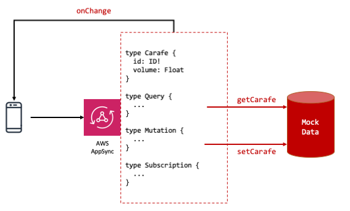
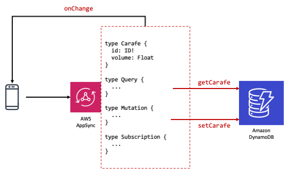

https://awsappsync.dev/

# Real-time GraphQL APIs for your app

Welcome to [AltConf 2019](http://altconf.com/)!

Let's build an [AWS AppSync GraphQL API](https://aws.amazon.com/appsync) to track the volume of coffee in a carafe. We'll use the API to update the volume in real-time as coffee is added or consumed.  

## **Prerequisites**

You can login to the [**AWS AppSync console**](https://us-west-2.console.aws.amazon.com/appsync/home?region=us-west-2#/) using your account. Please create an account if you don't have one.

## **Create the Schema and a Query**

AWS AppSync supports schema-first development. Let's create the backend for our app containing a minimal GraphQL schema and add a query.



* Open the **AWS AppSync Console**.
* Verify the Region is **US West (Oregon)**.
* Click **Create API**.
* Select **Build from scratch** and click the top **Start** button.
* Set the API name to **Coffee GraphQL** and click **Create**.
* Click **Schema** on the left.
* Setup our initial Schema. Paste the below into the Schema field and click **Save**:

```
type Carafe {
     id: ID!
     volume: Float
}

type Query {
    getCarafe(id: ID!): Carafe
}
```

## **Add a Resolver to the Query**

Now that we have a query, we need it to fetch results from somewhere. We accomplish this by attaching a data fetcher or a Resolver to the GraphQL Query field.

First, let's model the source of the data with a mock data source.

* Go to the **Schema** page.
* In the **Resolvers** section on the right, under **Query**: `getCarafe(...): Carafe`, click **Attach** then **Add datasource**.
* Name your Data source as **CarafeDataSource,** 
* We will use a mock data source. Set your Data source type to **None**
* Click **Create**.

Next, write logic to retrieve that data.

* Go back to the **Schema** page and click the same **Attach** button as before.
* In the **Data source name** drop down, select the **CarafeDataSource** item you just created.
* In the **Configure the request mapping template** section, paste the text below:

```
{
     "version": "2017-02-28",
     "payload": {
         "id": "MockCarafe",
         "volume": 3.14
     }
}
```
* Click **Save Resolver**.

Now, let's test our Query.

* In the **Queries** section, paste the below into the query field and click the orange Play button:

```
query GetCarafeVolume {
     getCarafe(id: "MockCarafe") {
         id
         volume
     }
}
```

The result should look like this:


```
{
     "data": {
         "getCarafe": {
             "id": "MockCarafe",
             "volume": 3.14
         }
     }
}
```

👏 Congratulations! You've created the GraphQL schema for your app and written a query to retrieve mock data.

## **Add a Mutation to the Schema**

Mutations are used in GraphQL to change data. A Mutation is a write operation followed by an immediate query. Let's add a mutation to modify our mock source and return the latest coffee volume.

First, we add a mutation to our schema and attach a resolver.

* In the **Schema** section, add the following text to the end of your schema:

```
type Mutation {
    setCarafe(id: ID!, volume: Float): Carafe
}
```

* Click **Save Schema**.
* In the resolvers section, under Mutation: `setCarafe(...): Carafe` click **Attach**.
* In the **Data source name** drop down, select the **CarafeDataSource** 
* In the **Configure the request mapping template** section, paste the text below:

```
{
     "version": "2017-02-28",
     "payload": {
         "id": "${context.arguments.id}",
         "volume": "${context.arguments.volume}"
     }
}
```

* Click **Save Resolver**.

Next, let's test the mutation.

* In the Queries section, paste the following text. You don't need to erase the existing query.

```
mutation UpdateCarafeVolume {
  setCarafe(id: "MockCarafe", volume: 0.1) {
    id
    volume
  }
}
```

Run this mutation and you will see the response containing the volume provided in the mutation argument.

👏 Congratulations! Your GraphQL backend can read and write data.

## **Add a Subscription to the Schema**

Queries and mutations are fun but GraphQL really shines by providing a third mechanism called Subscriptions to get updates without polling. Let's add a subscription to send interested listeners a message when the volume changes.

Let's add a subscription operation to our schema.

* In the **Schema** section, add the following text to the end of your schema:

```
type Subscription {
  changedCarafe: Carafe
    @aws_subscribe(mutations: ["setCarafe"])
}
```

* Click **Save Schema**.

* In the **Queries** section, paste the following text and click the orange Play button:

```
subscription ListenToChanges {
  changedCarafe {
    id
    volume
  }
}
```

We've activated a subscribes to changes processed by the `setCarafe` mutation. In order to view results, we will now trigger the mutation in a separate window.

* Open a new browser tab or window. Go back to the Queries section.
* Run the  `UpdateCarafeVolume` mutation.
* In the first tab you should see the data you just changed. This matches the result of the mutation.
* Test with other values for the mutation. 

👏 Congratulations! Your GraphQL backend can read and write data as well as receive updates in real-time!


## **Attach an Amazon DynamoDB Resolver**

We've used a mock data source until now. Changes made by our mutations are not stored anywhere and hence our queries don't read that data.

Let's change that by using Amazon DynamoDB, a key-value and document database to store the coffee volume. You can start with a table and import it into AWS AppSync. In this workshop, we'll start with the GraphQL schema and have AWS AppSync generate the DynamoDB table instead.



* In the **Schema** tab, click on **Create Resources**
* Select the **Use existing type** and select **Carafe**
* In the **Create a table to hold Carafe objects** section, leave everything as default except the **Automatically generate GraphQL** option. Untoggle this option.
* Click on **Create**.

AWS AppSync takes a few seconds to set up the table. If you want to see the table, go to the **Data Sources** section and open the link to the (**CarafeTable**) in a new tab.

Now that we have our table and generated GraphQL, let's modify our existing operations to write to this table.

* In the **Schema** section, click on the Resolver attached to the `setCarafe` type.
* Under the **Data source name** selection, select the new table created: **CarafeTable**.
* In the **Configure the request mapping template** section, expand the dropdown and select **PutItem**. This operation and template will save the input into the table and generate a new item ID on the server.
* Save the resolver.

To test the mutation, switch to the **Queries** section and run the mutation.

```
mutation SaveVolumeInTable {
  setCarafe(id: "doesnt-matter", volume: 0.3) {
    id
    volume
  }
}
```

Refresh the contents of the DynamoDB table and you'll see this item and value.

👏 Congratulations! Your GraphQL backend can write data to a persistent table!

*Note: save the **id** that was returned to you as a comment in the query editor. You'll need it soon!*

Let's modify our query to read from this table.

* In the **Schema** section, click on the Resolver attached to `getCarafe`.
* Under the **Data source name** selection, select the new table created: **CarafeTable**.
* In the **Configure the request mapping template** section, expand the dropdown and select **Get item by id.**
* Save the resolver.

That's it. Let's test the query.

* In the **Queries** section, run a query to retrieve the item. Use the ID you  copied previously.

```
query GetVolumeFromTable {
  getCarafe(id: "<PASTE YOUR ID HERE>") {
    id
    volume
  }
}
```

The response contains the volume stored in the table.

Try this out with several different mutations, queries, and subscriptions. What happens when you use the same ID? Do subscriptions still work?

👏 Congratulations! Your GraphQL backend can read and write data as well as receive updates in real-time from a persistent key-value database!

## Build a Swift app 
We are getting close to time so here's homework. Build a Swift app that displays the volume of the coffee carafe. Subscribe to the change notification to update the volume in real-time. You can base your solution on the [AWS AppSync sample app for iOS](https://github.com/aws-samples/aws-mobile-appsync-events-starter-ios).

Post a link to your app by [creating an issue](https://github.com/aws/aws-appsync-community/issues/) at [awsappsync.dev](https://awsappsync.dev). We will send every contributor a free t-shirt!

## Feedback

We 💜 feedback! Please let us know your experience with this workshop either in person, DM [Rohan (@appwiz) on Twitter](https://twitter.com/appwiz), or post an issue. PRs are welcome too! 🙏
